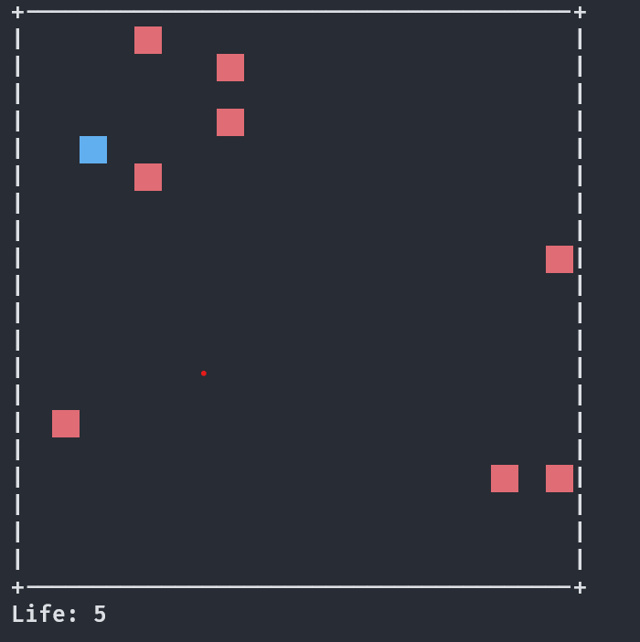

# Red Rain

**Red Rain** 是一款簡潔快速的 CLI 彈幕生存遊戲。你扮演一個藍色方塊，試著在紅色方塊的風暴中生存下來。

 <!-- 如果有畫面可以截圖加上 -->

## 🎮 遊戲規則

- 你是 **藍色方塊**。
- 使用鍵盤：
  - `W` / `S` 上下移動（玩家一）
  - 或 `K` / `J` 上下移動（玩家二或偏好另一套鍵位）
- 躲避從右方出現的 **紅色方塊**（代表子彈或敵人）
- 每次被紅色方塊碰撞，會失去一條命
- 起始共有 **5 條命**
- 每過一秒，紅色方塊的密度會逐漸增加
- **目標：儘量活得久一點！**
- 按 `esc` 離開遊戲

---

## 🛠️ 編譯與執行

```bash
mkdir build
cd build
cmake ..
make
./exec

